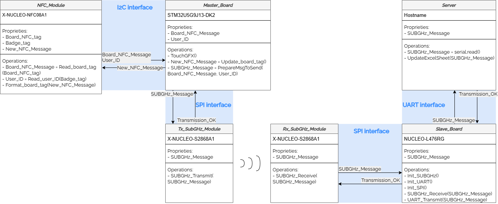

# Embedded-Inventory-Management-System
This repository contains a modular embedded system designed for automated inventory tracking using NFC technology, Sub-GHz communication, and an interactive graphical interface.
The project demonstrates an integrated hardware–software architecture built entirely on **STMicroelectronics components**, aiming to provide an extensible and intelligent embedded solution for managing tagged items.

---

## Repository Structure

```
Embedded_Inventory_System/
├── Database_update/
│   ├── README.md                # Details about the database update script
│   └── update_script.py         # Python script for database synchronization
│
├── STM32U5G9J-DK2_StockManagement_App/
│   └── ...                      # STM32 project for NFC + Sub-GHz transmission + TouchGFX GUI
│
├── STM32L476_SUBGHzReception/
│   └── ...                      # STM32 project for Sub-GHz message reception and logging
│
├── STM32L476_NFC08A1_StockEntryHelp/
│   ├── README.md                # Details about initial NFC tag setup
│   └── ...                      # STM32 project for reading and logging NFC IDs
│
└── Include/
    └── simple_system_architecture.drawio.png  # System architecture diagram
```

---

## Hardware Overview

| Role                        | Board              | Notes / Required Configuration                                                                                                |
| --------------------------- | ------------------ | ----------------------------------------------------------------------------------------------------------------------------- |
| **Master Board**            | `STM32U5G9J13-DK2` | Hosts the main logic, NFC interaction, Sub-GHz transmission, and TouchGFX GUI                                                 |
| **Slave Board**             | `NUCLEO-L476RG`    | Receives Sub-GHz messages and logs them to the host PC                                                                        |
| **NFC Extension Board**     | `X-NUCLEO-NFC08A1` | • Solder jumpers **ST2** and **ST4**  <br>• Add pull-ups **R116** and **R117** <br>• Remove SPI bridge and install I²C bridge |
| **Sub-GHz Extension Board** | `X-NUCLEO-S2868A2` | Mount **R22** to activate EEPROM (M95640-R SPI EEPROM)                                                                        |

---

## System Architecture

The architecture consists of multiple STM32-based modules responsible for:

* **NFC scanning** (board and user identification)
* **State encoding** (in/out of stock)
* **Wireless communication** via Sub-GHz
* **Data reception and parsing** on the receiver node
* **Database update** through a Python script
* **Real-time graphical feedback** on a TouchGFX interface

<div align="center">
  
  <br>
  <em>Figure 1. Simplified software architecture</em>
</div>

---

## Functional Components

### NFC Processing Loop

Implemented within the main application (`STM32U5G9J-DK2_StockManagement_App`), the NFC loop runs in `demoCycle()` and manages a state machine with the following sequence:

1. **Board Tag Scan (NFC-V)**

   * Detects the board’s NFC-V tag.
   * Reads UID and tag content to determine whether the board is being loaned or returned.

2. **Badge Scan (NFC-B)** *(conditional)*

   * When a loan action is detected, the system prompts the user to scan their NFC-B badge for identification.
   * Badge scanning is skipped for returns.

3. **Tag Formatting (Stock Status Encoding)**

   * Uses a modified `NdefT5TPollerTagFormat()` function to encode stock status in the tag’s EEPROM:

     * **In stock:** `03 01 01 FE`
     * **Out of stock:** `03 01 02 FE`
   * Each tag block follows the TLV (Type-Length-Value) message structure for data consistency.

4. **Sub-GHz Message Preparation**

   * After tag formatting, a message is prepared for transmission:

     * **Loan message:** `[UserUID]_[BoardUID]_[StateStock]`
     * **Return message:** `[BoardUID]_[StateStock]`
   * Buffers (`INmsg`, `OOmsg`) and flags (`INmsgReady`, `OOmsgReady`) control message flow to the Sub-GHz module.

---

### Sub-GHz Communication

Messages prepared on the **master** are transmitted via the **Sub-GHz module (X-NUCLEO-S2868A2)** and received by the **slave board (NUCLEO-L476RG)**.
The receiver logs the messages over UART to a connected PC.

A **Python script** then parses incoming serial data, extracts board and user IDs, determines the stock action, and **updates the Excel-based database** accordingly.

---

### GUI Implementation (TouchGFX)

The graphical interface provides real-time feedback and control, developed using **TouchGFX** on the STM32U5G9J-DK2.

* The GUI is managed under **FreeRTOS**, with two main tasks:

  * **TouchGFX Task** – handles UI rendering and input.
  * **Idle Task** – manages low-power operation.
* Data exchange between modules occurs through **RTOS message queues/mailboxes**.
* The **Model** class periodically polls for new data (`tick()` method) and updates the **Presenter** when new stock information arrives, triggering UI refreshes.

---

## Software Summary

| Module                                  | Description                                                                                            |
| --------------------------------------- | ------------------------------------------------------------------------------------------------------ |
| **Database_update/**                    | Contains the Python script for listening on serial ports, parsing messages, and updating the database. |
| **STM32U5G9J-DK2_StockManagement_App/** | Main embedded application (NFC handling, Sub-GHz TX, and TouchGFX UI).                                 |
| **STM32L476_SUBGHzReception/**          | Sub-GHz receiver firmware; logs incoming data and forwards it to the PC via UART.                      |
| **STM32L476_NFC08A1_StockEntryHelp/**   | Utility project for first-time setup (reads and logs NFC UIDs for system initialization).              |

---

## Technologies & Tools

* **Microcontrollers:** STM32U5G9J13-DK2, NUCLEO-L476RG
* **Communication:** NFC-V, NFC-B, Sub-GHz
* **Middleware:** ST25 NFC Libraries, Sub-GHz stack
* **GUI Framework:** TouchGFX
* **RTOS:** FreeRTOS
* **Scripting:** Python 3 (Serial + openpyxl for database update)
* **IDE:** STM32CubeIDE

---

## Future Extensions

The project architecture is intentionally open and modular, enabling:

* Integration with cloud databases or dashboards
* Multi-node Sub-GHz network support
* Tag authentication and encryption
* Additional sensors or tracking logic

---
